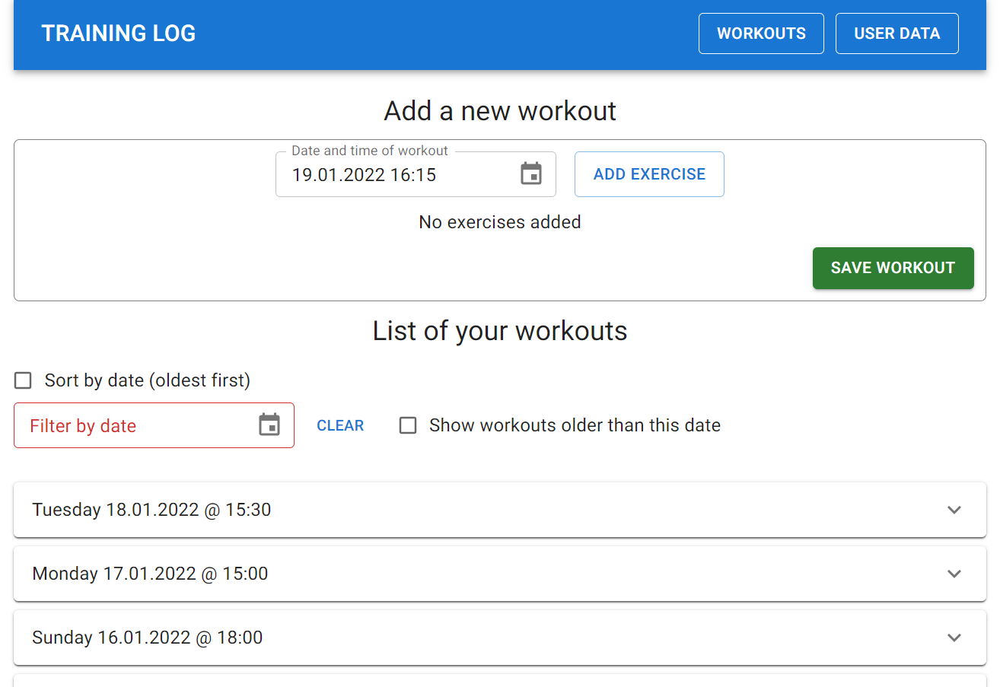
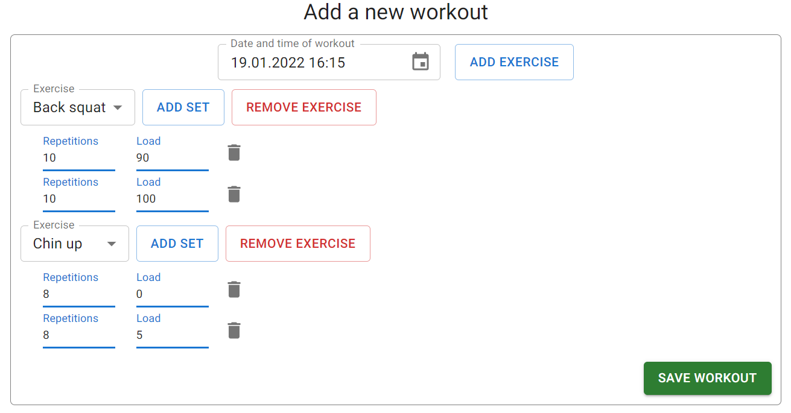
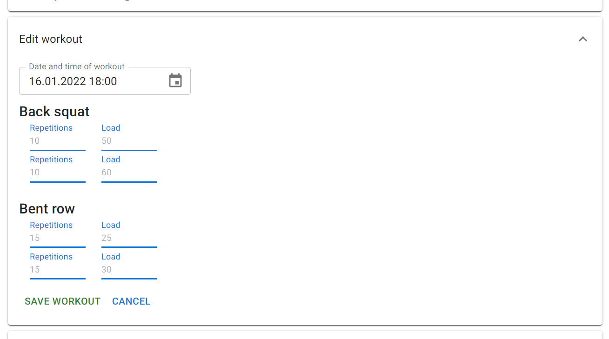
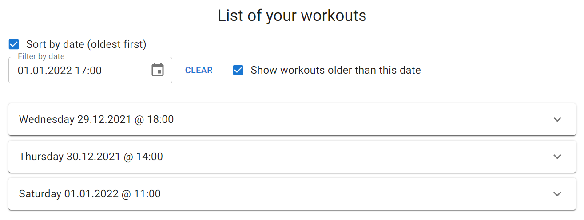

# Simple Training Log

[![Current Version][current-version]][current-version]

> Tracks your progress in the gym without pen and paper
***
**The application is published in Heroku and you can find it** [**here**](https://simple-training-log.herokuapp.com/)

[**SCREENCAST**](https://vimeo.com/666228662)
***



## About

A **training log** application for managing data related to **strength training**.

The app will support **basic CRUD operations** for individual training sessions, as well as **filtered and sorted views** of data.

This application was developed as a part of studies in TAMK to demonstrate skills in building a fullstack application.

## Media

#### Effortless to add new workouts



#### Edit existing workout data



#### Sort and filter the workouts



## Release History

* **1.0.0**
  * Initial release of the application
  * Features:
    * View, create and remove workouts
    * Modify workouts and personal user data
    * Sort and filter workouts by date
    * View, create and remove exercises

## Todo

- Backend
  - [x] Initialize project
  - [x] Design and create database
  - [x] Create basic CRUD methods for database (user)
  - [x] Create basic CRUD methods for database (admin)
  - [x] Create filtering and sorting functionality
  - [x] Create robust error handling in the backend
  - [ ] (Optional) Add authentication
- Frontend
  - [x] Create simple frontend for accessing API endpoints
  - [x] Design and create a nice UI for the app
  - [x] Create robust error handling in the UI
- Other
  - [x] Host app in Heroku
  - [ ] (Optional) Add license, if made public

## Installation for developers

Clone the repo

```
$ git clone https://github.com/roouit/training-log
```

Install dependencies for server code

```
$ cd training-log
$ npm install
```

Install dependencies for client code and build the code

```
$ cd src/frontend
$ npm install
$ npm run build
```

Setup your MariaDB (or MySQL) database and add your configuration to `.env` file on project root:

```
host = your host name
user = your username
password = your password
database = your database name
```

Create the necessary tables and some mock data with SQL queries in [here](docs/db-creation-queries.sql)

On project root, run the server `node src/index.js` and navigate to http://localhost:8080/ with your browser

### Known issues

**The app doesn't find my workouts even though they are in the database.**

This might be caused by the hard coded user IDs in API calls in `\training-log\src\frontend\src\shared\api\workout.js`. Change the user ID to correspond one on your database `user` table. Change the user ID for all API calls to fix other operations too.

**The app doesn't find my user data even though the user is in the database.**

This might be caused by the hard coded user ID in React component (**line 16**) `\training-log\src\frontend\src\core\app\settings\user-settings.component.js`. Change the user ID to correspond one on your database `user` table.

## Technology

* ### Frontend
  * **React** 17.0.2
  * [**Material UI**](https://mui.com/) 5.2.4
* ### Backend
  * **Node.js** 14.18.3 (Heroku)
  * **Express.js** 4.17.1
  * **MariaDB** 5.7.36-0ubuntu0.18.04.1-log

# REST API documentation

These documents describe what resources are exposed by the REST API and how to use them.

Documentation is split by resource:
* [User](src/api/v1/docs/user-api.md)
* [Exercise](src/api/v1/docs/exercise-api.md)
* [Workout](src/api/v1/docs/workout-api.md)

<!-- Markdown link & img dfn's -->
[current-version]: https://img.shields.io/badge/version-1.0.0-green